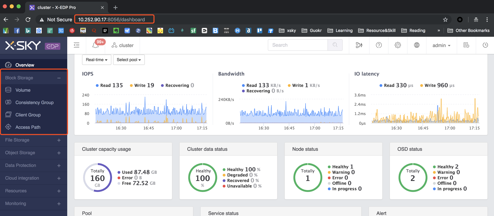

# XSKY CSI plugin for File Storage 1.0.0

[Home](https://xsky-storage.github.io/xsky-csi-driver/)

[Container Storage Interface (CSI)](https://github.com/container-storage-interface/) driver, provisioner, and attacher for XSKY ISCSI and NFS.


## Overview

XSKY CSI plugins implement interfaces of CSI. It allows dynamically provisioning XSKY volumes (File storage) and attaching them to workloads. Current implementation of XSKY CSI plugins was tested in Kubernetes environment (requires Kubernetes 1.11+), but the code does not rely on any Kubernetes specific calls (WIP to make it k8s agnostic) and should be able to run with any CSI enabled CO.

## Purpose of this article

Provide more details about configuration and deployment of Xsky File Storage driver
Introduce usage of Xsky Block Storage driver. see examples below.

* [Deployment](#Deployment)
* [Usage](#Usage)

Before to go,  you should have installed [XSKY SDS](https://www.xsky.com/en/)

Get latest version of XSKY CSI driver at [docker hub](https://hub.docker.com/u/xskydriver) by running `docker pull xskydriver/csi-nfs`


# Deployment

In this section，you will learn how to deploy the CSI driver and some necessary sidecar containers

## Prepare cluster

| Cluster | version |
| ----------| --------------|
| Kubernetes | 1.13 + |
| XSKY SDS | 4.0+          |


## Deploy CSI plugins


### Install dependencies

**Note：install these utils for all kubernetes node**

generally, Nodes should have install mount tools
incase of they don't, you can also install it by running
RedHat: `yum install nfs-utils`
Debian: `apt install nfs-common`


### Plugins

#### Get yaml file

Get yaml file from below links：

* [csi-attacher-rbac.yaml](https://xsky-storage.github.io/deploy/nfs/kubernetes/csi-sidecar-nfs-attacher-rbac.yaml)

* [csi-driver-rbac.yaml](https://xsky-storage.github.io/deploy/nfs/kubernetes/csi-xsky-nfs-driver-rbac.yaml)

* [csi-provisioner-rbac.yaml](https://xsky-storage.github.io/deploy/nfs/kubernetes/csi-sidecar-nfs-provisioner-rbac.yaml)

* [csi-sidecar-nfs-attacher.yaml](https://xsky-storage.github.io/deploy/nfs/kubernetes/csi-sidecar-nfs-attacher.yaml)

* [csi-sidecar-nfs-provisioner.yaml](https://xsky-storage.github.io/deploy/nfs/kubernetes/csi-sidecar-nfs-provisioner.yaml)

* [csi-xsky-nfs-driver.yaml](https://xsky-storage.github.io/deploy/nfs/kubernetes/csi-xsky-nfs-driver.yaml)


#### Remark on csi-nfs yaml
（**csi-xsky-nfs-driver.yaml**）

Usually, you dotn't need to alter any configurations we provided , but you can still modify this yaml to setup the driver for some situation.


#### Remark on sidecar provisioner yaml

Usually, you should keep value in default


#### deploy sidecar（Helper container）& node plugin

1. Create RABCs for sidecar container and node plugins:


   ```shell
   $ kubectl create -f csi-sidecar-nfs-attacher-rbac.yaml
   $ kubectl create -f csi-sidecar-nfs-provisioner-rbac.yaml
   $ kubectl create -f csi-xsky-nfs-driver-rbac.yaml
   ```
    > ignore the error if you have install xsky block driver . That error 
    is acceptable.

2. Deploy CSI sidecar container:

   ```shell
   $ kubectl create -f csi-sidecar-nfs-attacher.yaml
   $ kubectl create -f csi-sidecar-nfs-provisioner.yaml
   ```

3. Deoloy XSKY-FS CSI driver:

   ```shell
   $ kubectl create -f csi-xsky-nfs-driver.yaml
   ```

4. To verfify:

   ```shell
   $ kubectl get all
   ```

   

Congratulation to you, you have just finished the deployment. Now you can use them to provisioning XSKY block volume .


# Usage

In this section，you will learn how to dynamic provision file storage with XSKY CSI driver. Here I will Assumes you have installed XSKY SDS Cluster.


## Preparation

To continue，make sure you have finish the Deployment part.

Login to you SDS dashboard, your dashboard address should be `http://your_domain.com/8056`



**If use public share，you can skip this part**

### FS Client & Client Group

#### create fs client and add k8s-node


#### Continue to create client group and add k8s-client you just create to this group


As show above, please record the client group name.

#### Create File Gateway Group


#### Create File System and Share

create file system


share it


#### Add Client Group To Share And Enable k8s Visiting

a. For priviate share


b. For public share


Now your home share should looks like:


The home share will be used to provision volume


## Using

### Edit  yaml for StorageClass

#### sample（storageclass.yaml）

```yaml
apiVersion: storage.k8s.io/v1
kind: StorageClass
metadata:
   name: csi-nfs-sc
provisioner: com.nfs.csi.xsky
parameters:
    xmsServers: 10.252.90.39,10.252.90.40
    user: admin
    password: admin
    shares: 10.252.90.123:/sdsfs/dev_fs/,10.252.90.119:/sdsfs/csi-fs/
    clientGroupName: ""
reclaimPolicy: Delete

```


#### Explanation of StorageClass parameters

**name:** storageclass name

**provisioner:** sidecar csi-provisioner

**xmsServers:** SDS manager entry, use to connent XMS API，separated by comma

**user:** SDS user name

**password:** SDS secret

**shares:** home share, seperate by comma

**clientGroupName:** leave it empty string to indicate using public share


#### Creating storageclass

```shell
$ kubectl create -f storageclass.yaml
```


### Edit yaml for PersistentVolumeClaim

#### sample（pvc.yaml）

```yaml
apiVersion: v1
kind: PersistentVolumeClaim
metadata:
  name: csi-nfs-pvc
spec:
  accessModes:
  - ReadWriteOnce
  resources:
    requests:
      storage: 5Gi
  storageClassName: csi-nfs-sc
```


#### Explanation of pvc.yaml


#### Creating pvc

```shell
$ kubectl create -f pvc.yaml
```


#### Verify

- Run kubectl check command

  ```shell
  $ kebectl get pvc
  ```

  

- Check at SDS dashboard 

  
  
  > It will create quota tree under home share path

### Edit yaml for pod

#### sample（pod.yaml）

```yaml
apiVersion: v1
kind: Pod
metadata:
  name: csi-nfs-demopod
spec:
  containers:
   - name: web-server
     image: nginx 
     volumeMounts:
       - name: mypvc
         mountPath: /var/lib/www/html
  volumes:
   - name: mypvc
     persistentVolumeClaim:
       claimName: csi-nfs-pvc
       readOnly: false
```

#### Explanation of pod.yaml


#### Creating pod

```shell
$ kubectl create -f pod.yaml
```


#### Verify

- Run kubectl command to get pod

  ```shell
  $ kubectl get pod -o wide
  ```

  


[Home](https://xsky-storage.github.io/xsky-csi-driver/)